# Seleem

Software engineer building backend systems, infrastructure, and full-stack products.

I care about distributed systems, reliability, databases, performance, and software that keeps working when things go wrong.

Mostly working with **TypeScript, Python, NestJS, FastAPI, PostgreSQL, Redis, Next.js, Docker, and AWS**.

### Building

- **Watchrail** — uptime monitoring infrastructure with reliable job execution, HTTP monitoring, leases, and transactional outbox patterns.
- **Parqo** — edge-first smart parking infrastructure with ALPR, IoT, MQTT, offline operation, and cloud synchronization.
- **BillFlow** — invoicing and billing software for small businesses.

### Interests

Distributed systems · Backend architecture · Infrastructure · Databases · Applied AI

### Code

### Connect

[LinkedIn](https://www.linkedin.com/in/saleem-abdulsalam/) · [Email](mailto:saleem.abdulsalam20@gmail.com)
